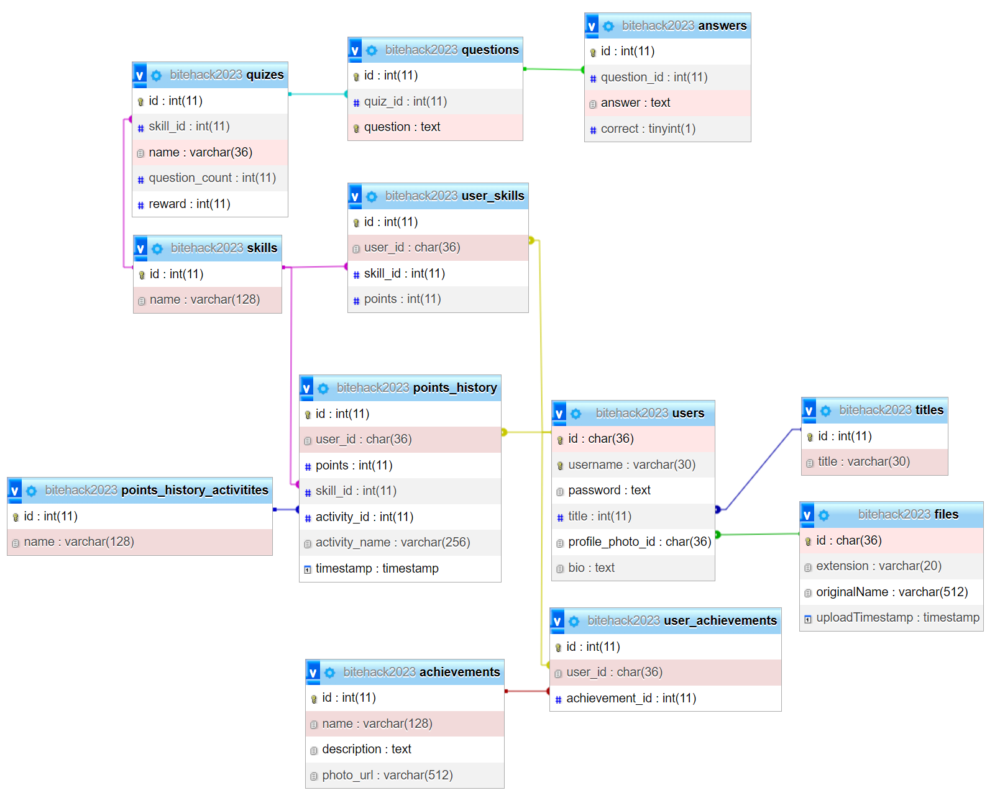

# Progresso - server

This repository only contains the server's code. For the main repository, see [Truly-Depressed-Developers/progresso](https://github.com/Truly-Depressed-Developers/progresso)

## Features

- Data storage in database
- Basic login and register
- Data access and modification through appropriate endpoints

## Tech Stack


## Installation

### Prerequisities

- XAMPP
- Node.js

### Database

1. Launch Apache and MySQL in XAMPP Control Panel
2. Open [localhost/phpmyadmin](https://localhost/phpmyadmin) and import database from [SQL file](./bitehack2023.sql). This will create database and user named bitehack2023

### Server

Clone this repo on your local machine
```
git clone https://github.com/Truly-Depressed-Developers/bitehack2023-server.git
cd bitehack2023-server
```

Install node modules
```
npm install
```

Run build once to create build folder
```
npm run build
```

Start live server
```
npm run dev
```

## Database structure


## Endpoints
<table>
	<tr>
		<th>Method</th>
		<th>Endpoint</th>
		<th>Required data</th>
		<th>Returned data</th>
 	</tr>
 	<tr>
  		<td>POST</td>
  		<td>/login</td>
   		<td>
            <ul>
                <li>username: string</li>
                <li>password: string</li>
            </ul>
        </td>
   		<td>
            <ul>
                <li>description: string</li>
                <li>username: string</li>
                <li>id: string</li>
            </ul>
        </td>
    </tr>
 	<tr>
  		<td>POST</td>
  		<td>/register</td>
   		<td>
            <ul>
                <li>username: string</li>
                <li>password: string</li>
            </ul>
        </td>
   		<td>
            <ul>
                <li>description: string</li>
            </ul>
        </td>
    </tr>
    <tr>
  		<td>GET</td>
  		<td>/file</td>
   		<td>
            <ul>
                <li>id: string</li>
            </ul>
        </td>
   		<td>File</td>
    </tr>
    <tr>
  		<td>POST</td>
  		<td>/file</td>
   		<td>File via multipart/form-data</td>
   		<td></td>
    </tr>
    <tr>
  		<td>POST</td>
  		<td>/title</td>
   		<td>
            <ul>
                <li>username: string</li>
                <li>title: string</li>
            </ul>
        </td>
   		<td>
            <ul>
                <li>description: string</li>
            </ul>
        </td>
    </tr>
    <tr>
  		<td>GET</td>
  		<td>/getUserData</td>
   		<td>
            <ul>
                <li>username: string</li>
            </ul>
        </td>
   		<td>
            <ul>
                <li>description: string</li>
                <li>data
                    <ul>
                        <li>single
                            <ul>
                                <li>username: string</li>
                                <li>title: string</li>
                                <li>bio: string</li>
                                <li>profile_photo_id: string</li>
                            </ul>
                        </li>
                        <li>skills: list of:
                            <ul>
                                <li>id: number</li>
                                <li>name: string</li>
                                <li>points: number</li>
                                <li>user_id: string</li>
                            </ul>
                        </li>
                        <li>achievements: list of:
                            <ul>
                                <li>id: number</li>
                                <li>name: string</li>
                                <li>description: string</li>
                                <li>photo_url: string</li>
                            </ul>
                        </li>
                        <li>points_history: list of:
                            <ul>
                                <li>id: number</li>
                                <li>points: number</li>
                                <li>skill: string</li>
                                <li>activity_type: string</li>
                                <li>activity_name: string</li>
                                <li>timestamp: string</li>
                            </ul>
                        </li>
                    </ul>
                </li>
            </ul>
        </td>
    </tr>
    <tr>
  		<td>POST</td>
  		<td>/getUserData</td>
   		<td>
            <ul>
                <li>id: string</li>
            </ul>
        </td>
   		<td>
            <ul>
                <li>description: string</li>
                <li>data
                    <ul>
                        <li>single
                            <ul>
                                <li>username: string</li>
                                <li>title: string</li>
                                <li>bio: string</li>
                                <li>profile_photo_id: string</li>
                            </ul>
                        </li>
                        <li>skills: list of:
                            <ul>
                                <li>id: number</li>
                                <li>name: string</li>
                                <li>points: number</li>
                                <li>user_id: string</li>
                            </ul>
                        </li>
                        <li>achievements: list of:
                            <ul>
                                <li>id: number</li>
                                <li>name: string</li>
                                <li>description: string</li>
                                <li>photo_url: string</li>
                            </ul>
                        </li>
                        <li>points_history: list of:
                            <ul>
                                <li>id: number</li>
                                <li>points: number</li>
                                <li>skill: string</li>
                                <li>activity_type: string</li>
                                <li>activity_name: string</li>
                                <li>timestamp: string</li>
                            </ul>
                        </li>
                    </ul>
                </li>
            </ul>
        </td>
    </tr>
    <tr>
  		<td>GET</td>
  		<td>/allPdfs</td>
   		<td></td>
   		<td>
            list of:
            <ul>
                <li>id: string</li>
                <li>extension: string</li>
                <li>originalName: string</li>
                <li>uploadTimestamp: string</li>
            </ul>
        </td>
    </tr>
    <tr>
  		<td>GET</td>
  		<td>/getCategories</td>
   		<td></td>
   		<td>
            list of:
            <ul>
                <li>id: number</li>
                <li>name: string</li>
            </ul>
        </td>
    </tr>
    <tr>
  		<td>GET</td>
  		<td>/getQuizes</td>
   		<td></td>
   		<td>
            list of:
            <ul>
                <li>id: number</li>
                <li>name: string</li>
            </ul>
        </td>
    </tr>
    <tr>
  		<td>GET</td>
  		<td>/getQuestions</td>
   		<td></td>
   		<td>
            list of:
            <ul>
                <li>id: number</li>
                <li>question: string</li>
            </ul>
        </td>
    </tr>
    <tr>
  		<td>POST</td>
  		<td>/addQuiz</td>
   		<td>
            <ul>
                <li>skill_id: number</li>
                <li>name: string</li>
                <li>questionCount: number</li>
                <li>reward: number</li>
            </ul>
        </td>
   		<td>
            <ul>
                <li>description: string</li>
            </ul>
        </td>
    </tr>
    <tr>
  		<td>POST</td>
  		<td>/addQuestion</td>
   		<td>
            <ul>
                <li>quizId: string</li>
                <li>question: string</li>
            </ul>
        </td>
   		<td>
            <ul>
                <li>description: string</li>
            </ul>
        </td>
    </tr>
    <tr>
  		<td>POST</td>
  		<td>/addAnswer</td>
   		<td>
            <ul>
                <li>questionId: number</li>
                <li>answer: string</li>
                <li>correct: boolean</li>
            </ul>
        </td>
   		<td>
            <ul>
                <li>description: string</li>
            </ul>
        </td>
    </tr>
    <tr>
  		<td>POST</td>
  		<td>/addWholeQuestion</td>
   		<td>
            <ul>
                <li>quiz_id: number</li>
                <li>question: string</li>
                <li>answers: string[]</li>
                <li>correctAnswer: string</li>
            </ul>
        </td>
   		<td>
            <ul>
                <li>description: string</li>
            </ul>
        </td>
    </tr>
    <tr>
  		<td>POST</td>
  		<td>/evaluateQuiz</td>
   		<td>
            <ul>
                <li>id: string</li>
                <li>ids: number[]</li>
                <li>quiz_id: number</li>
            </ul>
        </td>
   		<td>
            <ul>
                <li>description: string</li>
                <li>correct: boolean</li>
            </ul>
        </td>
    </tr>
    <tr>
  		<td>GET</td>
  		<td>/getCompleteQuiz</td>
   		<td>
            <ul>
                <li>id: number</li>
            </ul>
        </td>
        <td>
            <ul>
                <li>description: string</li>
                <li>quizId: number</li>
                <li>questions: list of:
                    <ul>
                        <li>id: number</li>
                        <li>question: string</li>
                    </ul>
                </li>
                <li>answers
                    <ul>
                        <li>[answer_id: number]
                            <ul>
                                <li>id: number</li>
                                <li>answer: string</li>
                            </ul>
                        </li>
                    </ul>
                </li>
            </ul>
        </td>
    </tr>
    <tr>
  		<td>GET</td>
  		<td>/skillLeaderboardGroupedBySkills</td>
   		<td></td>
   		<td>
            list of:
            <ul>
                <li>username: string</li>
                <li>skill_id: number</li>
                <li>skill_name: string</li>
                <li>points: number</li>
            </ul>
        </td>
    </tr>
    <tr>
  		<td>GET</td>
  		<td>/skillLeaderboardBySkill</td>
   		<td>
            <ul>
                <li>skill_id: number</li>
            </ul>        
        </td>
   		<td>
            list of:
            <ul>
                <li>username: string</li>
                <li>skill_id: number</li>
                <li>skill_name: string</li>
                <li>points: number</li>
            </ul>
        </td>
    </tr>
    <tr>
  		<td>GET</td>
  		<td>/skillLeaderboardSumAllSkills</td>
   		<td></td>
   		<td>
            list of:
            <ul>
                <li>username: string</li>
                <li>points: number</li>
            </ul>
        </td>
    </tr>
</table>

## License

This project is licensed under [MIT](./LICENSE) license.
